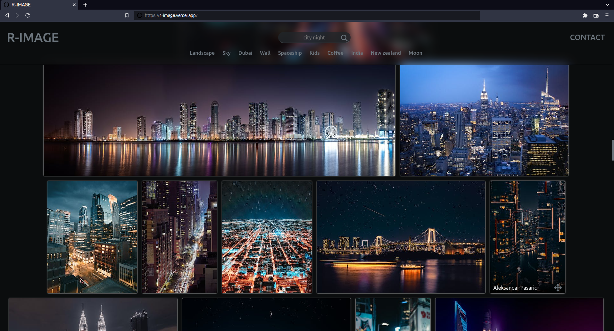
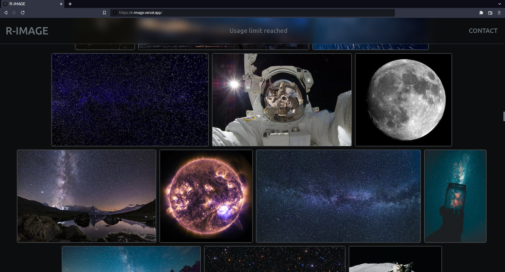
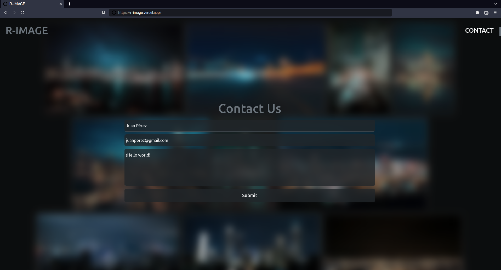
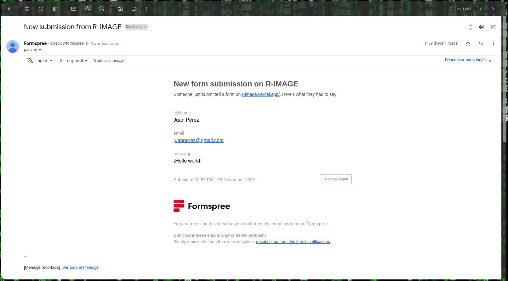
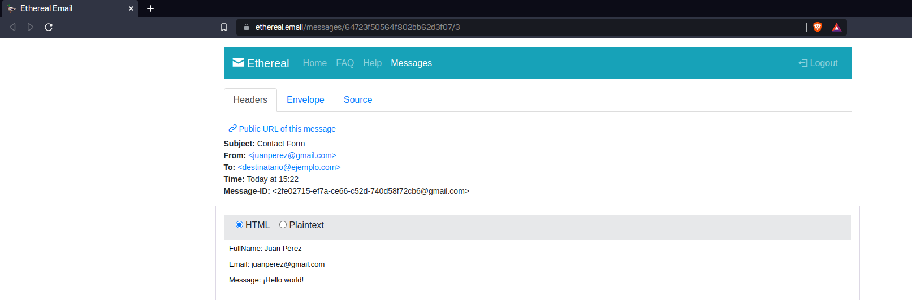

# R-IMAGE 
## MERN based web app to view random images of selected theme
<br>
### Source of the images
The images and other information are obtained from the [Pexels](https://www.pexels.com/ "") [api](https://www.pexels.com/api/documentation/ "").<br>
### Limits
By default, the pexels API has a limited rate of requests per hour and per month.<br>
For more information see [this](https://www.pexels.com/api/documentation/#guidelines, "").<br>
<br>
### Environment Variables
In the project client root directory:<br>
```vim .env.local```<br>
```
    REACT_APP_API_URL=YOUR_URL_TO_CONNECT_TO_THE_SERVER
    REACT_APP_API_TOKEN=YOUR_AUTH_TOKEN_TO_CONNECT
```

In the project server root directory:<br>
```vim .env```<br>
```
    MONGODB_URI=YOUR_URL_TO_CONNECT_TO_MONGODB
    PEXELS_API_KEY=YOUR_PEXELS_TOKEN
    CORS=1
    VERCEL=0
    SEARCH=SEARCH_OPTION
    PORT=YOUR_PORT
    API_TOKEN=YOUR_AUTH_TOKEN_TO_CONNECT
    SENDSYSTEM=SELECTED_EMAIL_SYSTEM
```
##### SEARCH OPCTION
Allows you to select between two different methods to search for new images. According to the database service available:<br>
If you use the MongoDB Atlas shared plan, you should set
```
    SEARCH=AtlasFree
```
If you use other MongoDB Atlas plan or mongodb on localhost, you should set:<br>
```
    SEARCH=mongodb
```
##### VERCEL
In the vercel deploy it automatically sets the variables PORT and VERCEL<br>
#### Pexels Token
To create the authentication pexels token you can see [this](https://www.pexels.com/api/documentation/#authorization "").<br>
#### Submit Contact Email
<br><br>
[FormsPree](https://formspree.io "") has been tested successfully.<br><br>
<br>
To use it, you need to set the following environment variables on the server:
```
    SENDSYSTEM=Formspree
    FORMSPREE_SUBMIT_URL=YOUR_URL_FOR_SUBMIT
```
<br><br>
[Ethereal](https://ethereal.email "") has been tested successfully.<br><br>
<br>
To use it, you need to set the following environment variables on the server:
```
    SENDSYSTEM=Nodemailer
    NODEMAILER_TRANSPORTER_USER=LINKED_EMAIL_ACCOUNT
    NODEMAILER_TRANSPORTER_PASS=LINKED_EMAIL_ACCOUNT_PASSWORD
    NODEMAILER_MAILOPTIONS_ADDRESSEE=EMAIL_RECEIVER
```